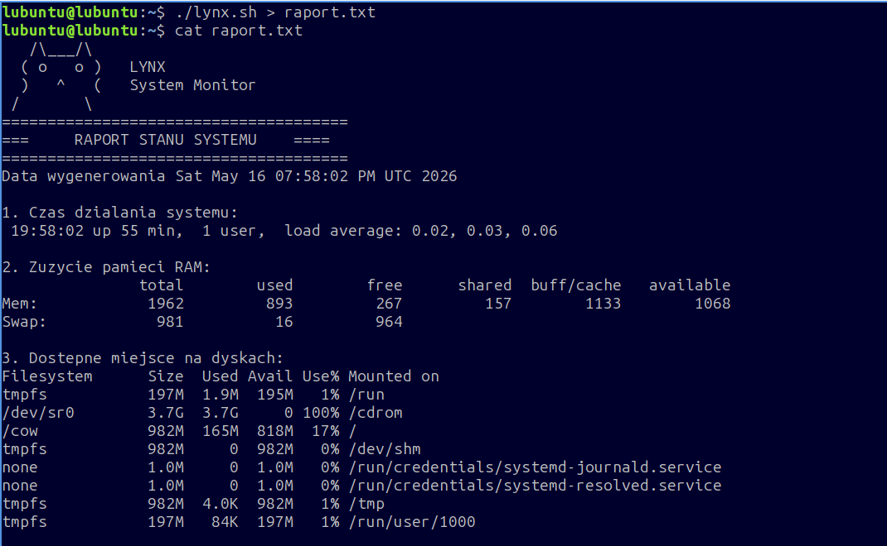
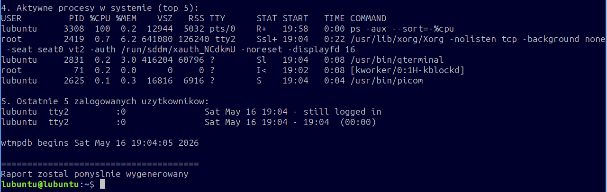

# Prosty Skrypt Monitorujący System (Linux)

## Co robi ten skrypt?
Skrypt po uruchomieniu zbiera kluczowe informacje o stanie serwera:
* Sprawdza aktualny czas działania systemu (Uptime).
* Pokazuje zużycie pamięci RAM.
* Wyświetal dostępne miejsce na dyskach.
* Wyciąga 5 najbardziej obciążających system procesów.
* Pokazuje listę ostatnich logowań użytkowników.

## Jak go uruchomić?
1. Nadaj uprawnienia do uruchomienia:
   chmod +x lynx.sh
2. Uruchom skrypt z zapisem wyniku do pliku tekstowego:
   ./lynx.sh > raport.txt

## Podgląd działania skryptu

Oto jak wygląda wygenerowany raport:

